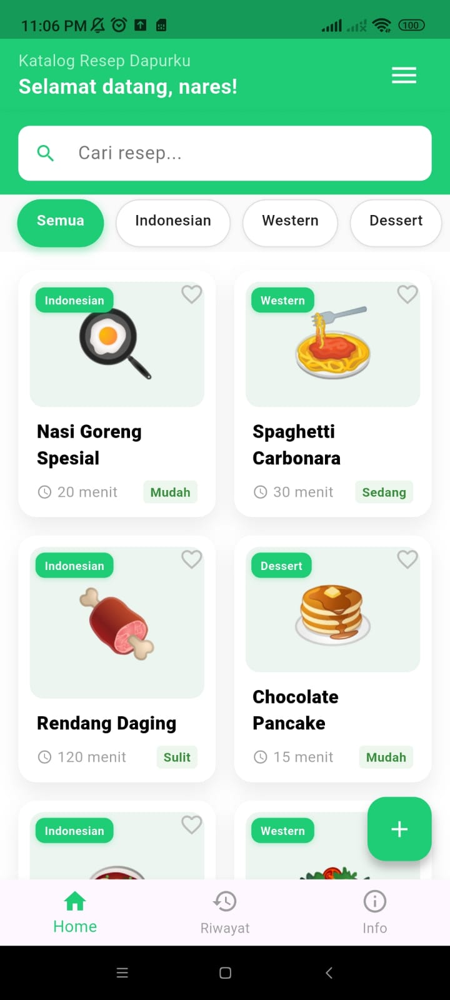

# Icon Aplikasi 

  

# 🥘Aplikasi Resep Dapurku

Deskripsi Pendek : Aplikasi Resep Dapurku adalah asisten dapur pribadi untuk menemukan, mengelola, dan menyimpan resep masakan lezat dengan mudah

Deskripsi Panjang : 

Resep Dapurku adalah aplikasi berbasis Flutter yang dibuat untuk membantu Anda mengatur resep masakan sehari-hari secara praktis, cepat, dan rapi. Tidak hanya menyimpan nama masakan, aplikasi ini juga menyediakan informasi lengkap mengenai setiap resep, mulai dari kategori utama, sub-kategori spesifik seperti masakan Padang, Sup, atau Pasta, hingga perkiraan lama masak dan tingkat kesulitannya. Fitur ini membantu pengguna, baik yang pemula maupun suka memasak, dalam merencanakan aktivitas di dapur lebih terarah.

Selain itu, aplikasi ini juga dilengkapi dengan fitur riwayat resep dan daftar favorit, sehingga pengguna bisa dengan mudah mengakses masakan yang sering dibuat atau menyimpan ide masakan untuk hari mendatang.
Untuk memudahkan pengguna, Resep Dapurku juga menyediakan pilihan mode tampilan, yaitu mode Grid untuk tampilan yang menarik atau mode List untuk navigasi yang lebih sederhana, sehingga membuat pengalaman memasak lebih menyenangkan.

Aplikasi ini juga memiliki halaman profil pengembang dan informasi terkait aplikasi, sehingga pengguna bisa mengetahui teknologi yang digunakan atau menghubungi pengembang untuk memberikan saran atau masukan demi perbaikan fitur di masa depan.
Dengan antarmuka yang bersih, sistem kategori yang cerdas, serta navigasi yang mudah dipahami, Resep Dapurku adalah asisten setia yang selalu menyertai perjalanan memasak Anda setiap hari.

Aplikasi katalog resep dapurku sederhana menggunakan Flutter dengan fitur:
- Login aplikasi
- Tambah resep
- Edit Resep
- Hapus Resep
- Lihat detail resep
- Filter kategori
- Riwayat edit resep
- Info Aplikasi
- Info Pengembang
- Ubah nama user
- UI clean & modern

*Projek ini dibuat untuk memenuhi tugas UTS pada mata kuliah Pemrograman Mobile 2

| Informasi Pengembang |
| :--- | :--- |
| **Nama** | **Alvina Nindita Nareswari** |
| **NIM** | 2205101047 |
| **Kelas** | 7C/TIF |

---

  
  
  
  
  
  
  
  
  
  
  

