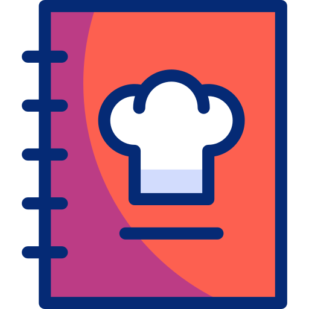
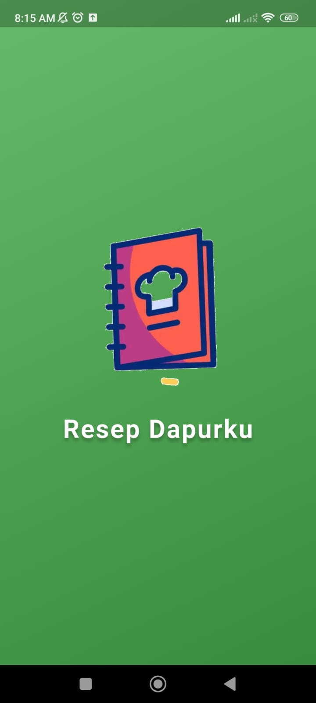
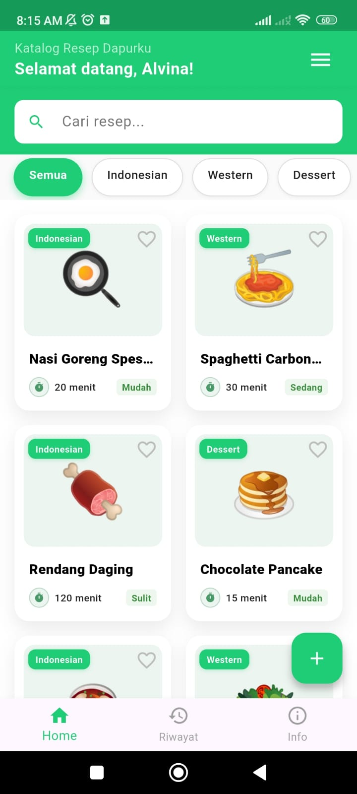
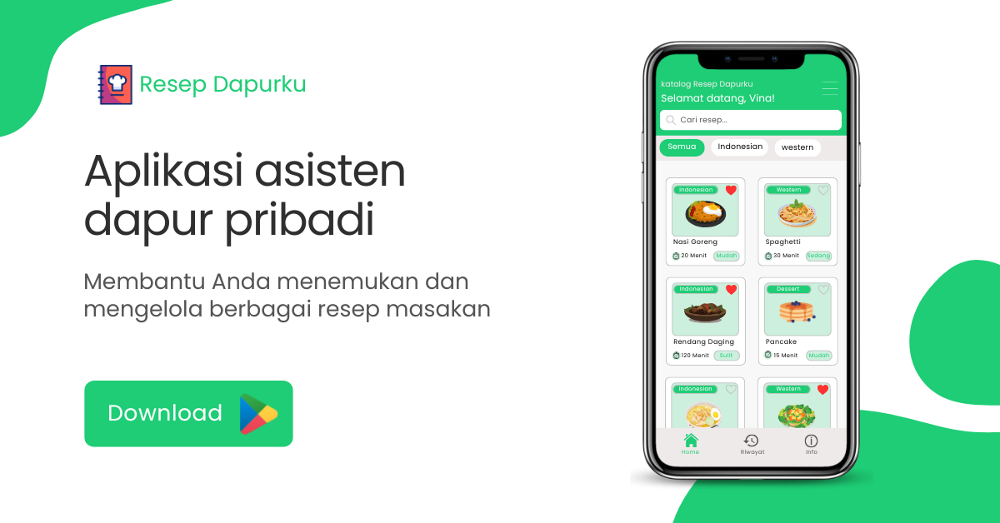

# Icon Aplikasi 

  

---

# 🥘Aplikasi Resep Dapurku

Deskripsi Pendek : Aplikasi Resep Dapurku adalah asisten dapur pribadi untuk menemukan, mengelola, dan menyimpan resep masakan lezat dengan mudah

Deskripsi Panjang : 

Resep Dapurku adalah aplikasi berbasis Flutter yang dibuat untuk membantu Anda mengatur resep masakan sehari-hari secara praktis, cepat, dan rapi. Tidak hanya menyimpan nama masakan, aplikasi ini juga menyediakan informasi lengkap mengenai setiap resep, mulai dari kategori utama, sub-kategori spesifik seperti masakan Padang, Sup, atau Pasta, hingga perkiraan lama masak dan tingkat kesulitannya. Fitur ini membantu pengguna, baik yang pemula maupun suka memasak, dalam merencanakan aktivitas di dapur lebih terarah.

Selain itu, aplikasi ini juga dilengkapi dengan fitur riwayat resep dan daftar favorit, sehingga pengguna bisa dengan mudah mengakses masakan yang sering dibuat atau menyimpan ide masakan untuk hari mendatang.
Untuk memudahkan pengguna, Resep Dapurku juga menyediakan pilihan mode tampilan, yaitu mode Grid untuk tampilan yang menarik atau mode List untuk navigasi yang lebih sederhana, sehingga membuat pengalaman memasak lebih menyenangkan.

Aplikasi ini juga memiliki halaman profil pengembang dan informasi terkait aplikasi, sehingga pengguna bisa mengetahui teknologi yang digunakan atau menghubungi pengembang untuk memberikan saran atau masukan demi perbaikan fitur di masa depan.
Dengan antarmuka yang bersih, sistem kategori yang cerdas, serta navigasi yang mudah dipahami, Resep Dapurku adalah asisten setia yang selalu menyertai perjalanan memasak Anda setiap hari.

Aplikasi katalog resep dapurku sederhana menggunakan Flutter dengan fitur:
- Login aplikasi
- Tambah resep
- Edit Resep
- Hapus Resep
- Lihat detail resep
- Filter kategori
- Riwayat edit resep
- Info Aplikasi
- Info Pengembang
- Ubah nama user
- UI clean & modern

---

*Projek ini dibuat untuk memenuhi tugas UTS pada mata kuliah Pemrograman Mobile 2

| Informasi | Pengembang |
| :--- | :--- |
| **Nama** | **Alvina Nindita Nareswari** |
| **NIM** | 2205101047 |
| **Kelas** | 7C/TIF |

---

# Kategori Aplikasi
Makanan dan Minuman

---

# Screenshot

  
  
  
  
  
  
  
  
  
  
  
  
  

---

# Kebijakan Privasi (Privacy Policy)
Terakhir diperbarui: 2026

Resep Dapurku berkomitmen untuk melindungi privasi dan data pengguna. Dokumen ini menjelaskan bagaimana aplikasi mengelola, menyimpan, dan menggunakan informasi yang Anda berikan. Dengan menggunakan Resep Dapurku, Anda dianggap telah memahami dan menyetujui kebijakan privasi ini.

🔐 1. Informasi yang Dikumpulkan Resep Dapurku hanya mengumpulkan jenis informasi berikut:

Nama pengguna: Digunakan untuk keperluan personalisasi tampilan di dalam aplikasi.

Data Resep: Meliputi nama masakan, kategori, sub-kategori, bahan-bahan, dan deskripsi yang Anda masukkan secara manual.

Aplikasi tidak mengumpulkan informasi sensitif seperti email, lokasi GPS, kontak, atau data pribadi lainnya.

💾 2. Penggunaan Informasi Data yang Anda berikan digunakan hanya untuk:

Menampilkan nama Anda di dalam menu drawer aplikasi.

Menyimpan, mengelola, dan menampilkan daftar resep masakan harian Anda.

Mengelola daftar favorit dan riwayat perubahan resep.

Resep Dapurku tidak mengirimkan data ke server mana pun.

📁 3. Penyimpanan Data

Penyimpanan Lokal: Seluruh data nama pengguna dan resep disimpan secara lokal di perangkat Anda menggunakan Shared Preferences dan Provider state management.

Akses Offline: Aplikasi ini bekerja sepenuhnya secara offline, sehingga tidak ada aktivitas pengunggahan data ke internet.

Kontrol Pengguna: Pengguna dapat mengubah nama pengguna atau menghapus resep kapan saja melalui fitur yang tersedia di aplikasi.

🔒 4. Keamanan Data Resep Dapurku memastikan keamanan informasi Anda dengan prinsip:

Tanpa Pihak Ketiga: Tidak ada pihak ketiga yang dapat mengakses, melihat, atau mengambil data resep Anda.

Tanpa Pelacakan: Tidak ada proses tracking, analitik perilaku, atau iklan yang mengumpulkan data secara otomatis.

Kendali Penuh: Semua data sepenuhnya berada di bawah kendali perangkat fisik pengguna.

👤 5. Hak Pengguna Anda memiliki hak penuh untuk:

Mengubah nama pengguna melalui menu pengaturan/drawer.

Menambah, mengubah, atau menghapus data resep secara permanen.

Penghapusan Data: Seluruh data akan terhapus secara otomatis dan permanen jika Anda menghapus (uninstall) aplikasi dari perangkat Anda, karena data tidak dicadangkan di awan (cloud).

📝 6. Perubahan Kebijakan Privasi Kebijakan ini dapat diperbarui sewaktu-waktu seiring dengan pengembangan fitur aplikasi. Perubahan akan diinformasikan melalui pembaruan aplikasi atau melalui dokumentasi resmi di repositori GitHub pengembang.

📬 7. Kontak Developer

Jika Anda memiliki pertanyaan, masukan, atau laporan terkait aplikasi, silakan hubungi:
Email Developer: alvinanindita28@gmail.com
Lihat dokumen lengkap: Privacy Policy

---

# Tag

Dapur, Masak, Resep harian, Menu keluarga, Buku resep digital, Kuliner, Food Manager, Indonesia Food, Asisten Masak, Resep Praktis.

# Feature Graphic

  

